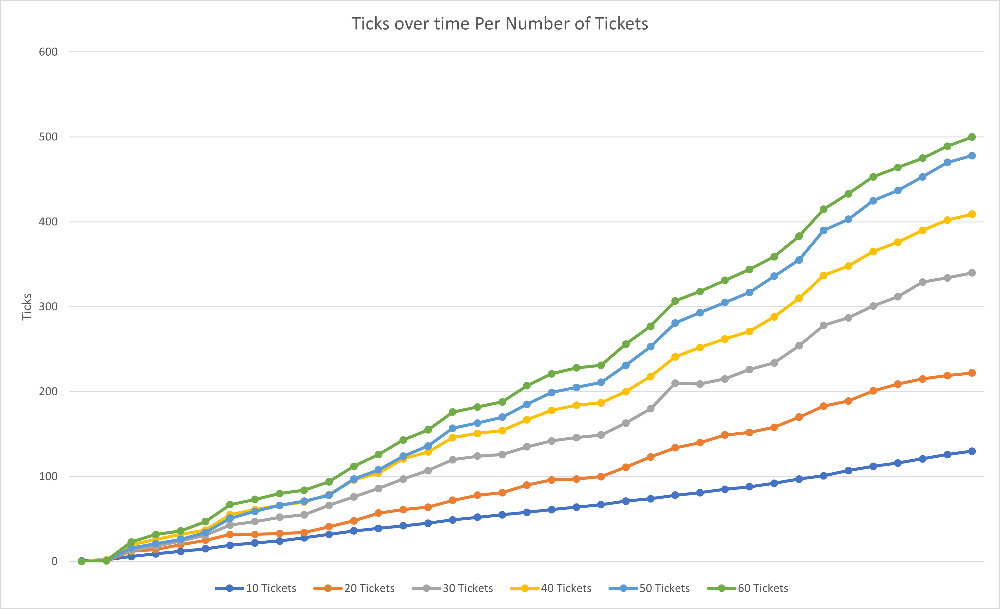

Files modified include:
- [proc.c](kernel/proc.c)
    - tickets are set to 1 by default for new procs
    - in fork(), number of tickets for a forked child are set to the number of tickets that the parent had
    - lottery scheduler implemented
    - settickets takes the current proc and sets the tickets field for it to the parameter
    - getpinfo goes through every proc, aggregating fields for pstat struct, copies the struct to userspace
- [sysproc.c](kernel/sysproc.c)
    - pointer copying for settickets and getpinfo
- [getpinfo.c](user/getpinfo.c)
    - forks 6 times, creating 6 procs
    - on the first proc, every so often getpinfo from [proc.c](kernel/proc.c) is run and the aggregated pstat struct is printed
    - the number of ticks that each forked proc increased by between each iteration is also printed
- [settickets.c](user/settickets.c)
    - pretty much pointer passing to the function in [proc.c](kernel/proc.c)

Additionally, the necessary header files and makefiles for all of these were modified with the new functions to get xv6 to compile. Also, the files required to randomly generate numbers: [useRandom.c](kernel/useRandom.c), [random.c](kernel/random.c), and [random.h](kernel/random.h). And, [pstat.h](kernel/pstat.h).

My [graph](misc/graph.png) (shown below) and the [output](misc/graphoutput.txt) that it comes from is in the /misc directory. The [Excel file](misc/Graph.xlsx) used to produce the graph is also in there for good measure.

